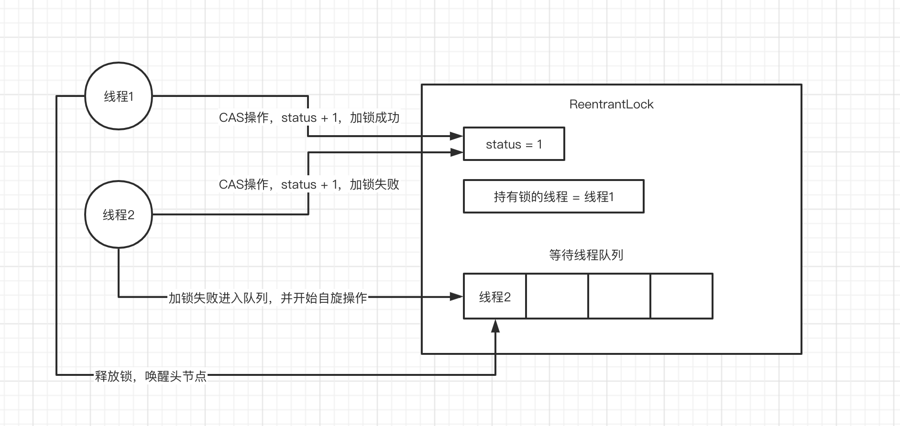
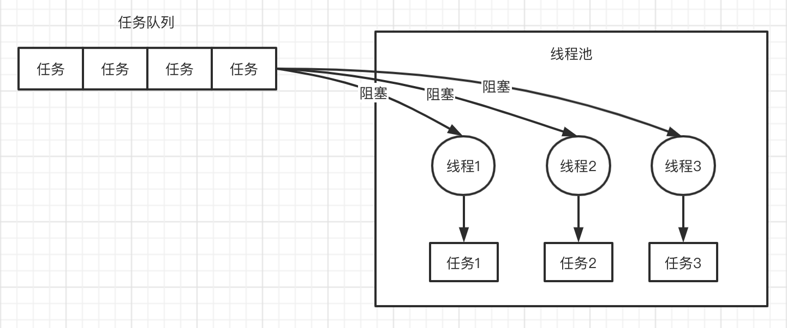
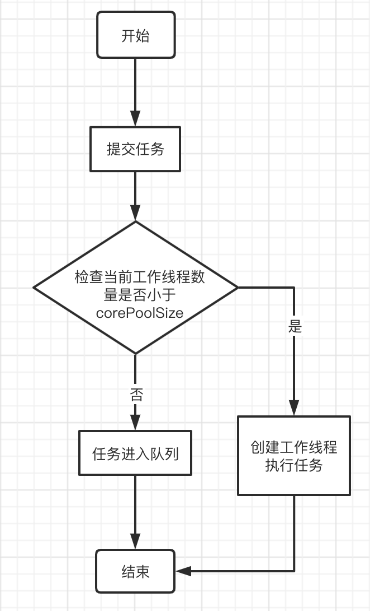
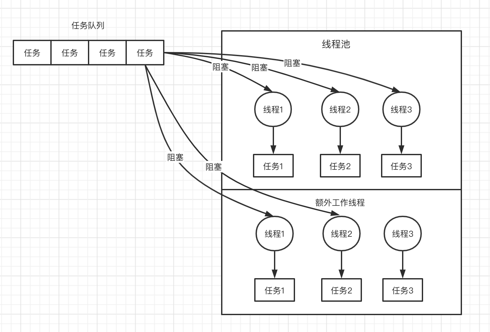
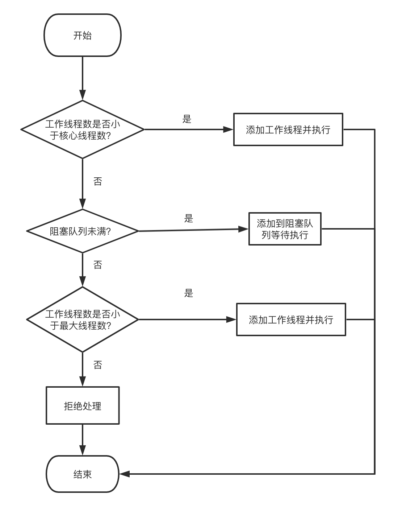

# 后端技术问题

## 集合框架
 
### 你知道HashMap底层的数据结构是什么吗？
数组 + 链表 + 红黑树

### JDK1.8 中对hash算法和寻址算法是如何优化的？
HashMap中的hash算法：计算key的hashCode值，并把高16位和底16位进行异或运算。

HashMap中的寻址算法：hash & (n - 1) 代替 取模运算，因为位运算性能要高。

为什么hash算法中要对高位和低位进行异？

优化 hash 算法，减少 hash 冲突。因为后面的寻址算法中，会进行 hash & (n - 1) 运算，一般情况下 (n - 1) 比较小，所以 hash 值的高位会被直接丢弃掉，可以认为高位没有参与运算，高位的特征值被直接丢弃掉了。而 hash 算法中，把高位和低位进行异或运算，保留了高位的特征，后面进行寻址算法的时候，高位部分也能参与进来。

为什么寻址算法中 & 运算比取模运算性能高？

因为在HashMap的构造方法中 会把 n 约束为 >= n 的 2的幂，所以就能保证 & 运算的结果和取模的结果一致。

为什么 HashMap 中数组的大小为 2 的幂？

### 你知道HashMap是如何解决hash碰撞问题的吗？

hash 碰撞：两个不同的key，经过hashCode运算出 hash 值，进行寻址算法定位出来的数组下标一样

链表 O(n)

链表长度超过一定数量时会转换为红黑树 O(logn)

### 说说HashMap的 put 方法？

1. 扩容 当数组为空时，需要扩容（初始化）
2. 查询 根据 key 的 hash 值 + 寻址算法定位到 数组对应索引 
3. 插入 
	* 数组槽位为空，直接插入
	* 数组槽位非空，根据 key 的引用和 key.equals() 方法进行匹配，匹配不到就插入，匹配到再决定是否替换
4. 扩容 插入之后，判断 hash 的实际容量是否大于阈值，决定是否需要扩容

### 说说HashMap是如何进行扩容的？

扩容步骤：

1. 数组容量翻倍
2. 遍历 hash 表中数组，对每个Node进行 rehash （重新计算其在新数组中的下标 ）

JDK1.8 rehash 的技巧：扩容之后，需要重新计算 hash 值在新数组中的下标，而寻址算法 hash & (newCap - 1) 有个特点，(newCap - 1) 的二进制值比 (oldCap - 1) 多一个 "1"，因此 rehash 计算出新数组中的下标只有两种可能：

* 保持不变
* 原位置 + oldCap

## 并发编程
 
### 说说synchronized关键字的底层原理是什么？

#### 较浅的理解
synchronized 主要用于加锁，一般是给一个对象加锁。线程1执行代码给 obj1 加锁，那么线程2执行代码，就需要等待现在其他现场释放 obj1 对象上的锁。 

注意：锁住的是对象

```
Object obj1 = new Object();
Object obj2 = new Object();

synchronized (obj1) {
    // 各种操作
}

synchronized (obj2) {
    // 各种操作
}
```

#### 深入理解
理解 synchronized 之前还需要介绍一些额外的知识：Java 对象头、monitor

**Java 对象头**

以Hotspot虚拟机为例，Hotspot的对象头主要包括两部分数据：Mark Word（标记字段）、Klass Pointer（类型指针）。Mark Word 中储存锁状态，锁状态包括无锁、偏向锁、轻量级锁、重量级锁

对象头锁状态是如何升级的？

**Monitor**

Monitor可以理解为一个同步工具或一种同步机制，通常被描述为一个对象。每一个Java对象就有一把看不见的锁，称为内部锁或者Monitor锁。

对象头和 Monitor 都能找到持有锁的线程id。在对象头中对于不同锁状态的对象头其储存的锁信息不一样。

Monitor是线程私有的数据结构，每一个线程都有一个可用monitor record列表，同时还有一个全局的可用列表。每一个被锁住的对象都会和一个monitor关联，同时monitor中有一个Owner字段存放拥有该锁的线程的唯一标识，表示该锁被这个线程占用。

**继续研究 synchronized**

Monitor中有储存持有锁的线程id，和计数器。线程A抢到锁，计数器会加 1。线程B会判断计数器是否为 0，如果不为 0 则挂起。

**synchronized 重入原理**

判断 Monitor中当线程id是否为当前线程id，是，则计数器加 1。每执行完一次同步，Monitor 中的计数器减 1。

### 能聊聊你对CAS的理解以及其底层实现原理可以吗？

CAS全称为 compareAndSwap。

场景：线程A、线程B、共享变量 a = 1，以AtomicInteger的自增函数为例子

1. 线程 A 准备给共享变量自增，首先线程 A 会读出变量 a 的值
2. 线程 A 带着之前读出的旧值，以及准备设置的新值
3. CAS操作（CAS操作在硬件级别是原子的），判断旧值是否等一当前内存中a的值，等于那么设置成功，不等于设置失败。
4. 重复步骤1 ～ 3

注意：CAS 在底层的硬件级别一定要保证原子性，也就是上面的步骤3 一定是原子操作。

### 可重入锁
可重入锁是什么？

```
public class SyncTest {

    public synchronized void test1() {

        System.out.println("test1");
    }

    public synchronized void test2() {
        System.out.println("test2");
    }

    public void test3() {
        test1();
        test2();
    }
}
```
如上代码：

线程在执行test3 方法的时候，需要重复的获取 test1、test2 方法的锁。这就是可重入锁，她解决的就是死锁的问题。

### ConcurrentHashMap实现线程安全的底层原理到底是什么？
JDK 1.8 以前，采用多个数组，分段加锁。锁住的是一个大数组。

JDK1.8 put()方法原理

首先是自旋（死循环）操作，数组节点为null采用CAS操作，数组节点为非空则对非空节点加syncronized 锁，再进行相应的插入操作。

### 你对JDK中的AQS理解吗？讲讲ReentrantLock实现原理？

AQS 全称 AbstractQueuedSynchronizer，里面主要包括 status 状态，以及获取锁和释放锁的模版方法

ReentrantLock实现原理


1. 线程1加锁，检查status == 0 ? 是，则加锁成功，status + 1，设值持有锁的线程 = 线程1
2. 线程2加锁，检查status == 0 ？否，加锁失败，线程2进入等待队列，并开始自旋操作
3. 线程1执行完同步代码，释放锁，status - 1，持有锁的线程 = null，唤醒等待队列的头节点

注意 ReentrantLock 中公平锁和非公平锁的区别

### 说说线程池的底层工作原理可以吗？

以 newFixedThreadPool 为例子，说一说线程池的原理。

```
// 核心线程池数量为3
ExecutorService threadPool = Executors.newFixedThreadPool(3);

threadPool.submit(new Callable() {
    public void run() {}
});
```


<center></center>

提交任务流程

1. 检查当前工作线程数是否小于corePoolSize
2. 是，则创建新工作线程执行任务。否，则将任务放入队列
3. 执行完任务的线程会阻塞的去队列中取任务

<center></center>

### 那你再说说线程池的核心配置参数都是干什么的？平时我们应该怎么用？
```
public ThreadPoolExecutor(int corePoolSize,
                              int maximumPoolSize,
                              long keepAliveTime,
                              TimeUnit unit,
                              BlockingQueue<Runnable> workQueue,
                              RejectedExecutionHandler handler)
```

* corePoolSize 线程池核心线程数
* maximumPoolSize 线程池最大线程数
* keepAliveTime 额外线程（除核心外）空闲时，最大存活时间
* unit keepAliveTime 的单位
* workQueue 阻塞队列
* handler 任务拒绝策略

以如下构造为例，聊一聊线程池工作原理

```
new ThreadPoolExecutor(3, 6, 600L, TimeUnit.SECONDS, new ArrayBlockingQueue<Runnable>(1000));
```

<center></center>

<center></center>

### 如果线上机器突然宕机，线程池的阻塞队列中的请求怎么办？
常规解决办法

任务在提交之前先持久化，并维护状态，未提交、已提交、已完成。发生宕机重启之后，启动一个后台线程取扫描数据库，把未提交和已提交状态的任务读取出来放入队列。

### 谈谈你对Java内存模型的理解可以吗？

四种内存屏障：

StoreStore
StoreLoad
LoadLoad
LoadStore

由于不同架构的CPU支持的内存屏障不同，x86 架构的 cpu 只支持 StoreLoad 屏障。下面介绍 StoreLoad 屏障是如何解决 MESI协议 引发的有序性和可见性问题。

### @Transaction 注解什么怎么生效的，方法之间的调用，什么情况生效什么情况不生效？

不是AOP对象事务就不生效

### 可重复读隔离级别下，能解决幻读的问题吗？
在 InnoDB 存储引擎下，对于普通的一致性读可以解决幻读问题，因为有MVCC机制。

在当前读的情况下，因为有间隙锁存在，所以插入操作会因为获取锁而阻塞。

### 分布式事务的解决方案

1. TCC 三步提交
2. 本地消息表
3. RocketMQ 可靠消息最终一致性

### 常用的限流算法有哪些？

计数器固定窗口

原理：维护一个计数器，煤气请求来的时候就 -1，等到下一期请求来的时候判断时间超过1 秒之后，计数器就重置。

优点：实现简单易用

缺点：限流效果不佳，会有流量突刺

滑动窗口

滑动窗口是固定窗口的升级版，因为只维护一个大窗口，会导致流量突刺。滑动窗口会在一个时间窗口中维护多个小窗口，并对单个小窗口设置流量阈值。当请求时间大于大窗口的最大时间时，窗口开始向右移动，舍弃最左边的一个小窗口，创建一个最右边的新窗口。

其核心在于，用多个小窗口去解决流量突刺的问题。

漏斗桶

维护一个漏斗容器，请求来了都会进入到漏斗中，都给我等着，后面超过了漏斗的最大容量之后请求就会被拒绝。然后会有一个线程以一定的速率去从漏斗中取请求，进行后续处理。

优点：限流速率均衡，不会出现突刺，

缺点：对于突发的流量没有较高的兼容性

令牌桶

维护一个容器，开启一个后台线程以一定的速率往容器中放令牌 token。请求来临时，会从容器中取token，取到临牌就能继续往下执行。取不到，后在容器中临牌为空的时候，就会阻塞。

优点：限流速率均衡，不会出现超过阈值的突刺，对于突发流量也有较好的支持。

### redis 持久化有哪几种方式？分别适用什么场景？

### 数据库性能优化方法？

SQL 优化：

1. 排查业务系统，SQL语句是否有索引，当数据量超过百万时，必须要加索引。
2. 单个表的索引不要过多，索引过多，更新语句效率变低，因为要维护多个索引表。
3. 尽量用联合索引，代替多个单值索引
5. 利用索引查询的时候，尽量采用覆盖索引，避免回表。
6. 利用索引等值查询时，如果发生类型转换会导致索引失效。
7. 查询的时候，如果对字段进行了函数运算，会导致索引失效

数据库性能优化：

1. redo log 日志写满的情况
2. buffer pool 缓存不够用，需要刷脏页的情况

优化方向：提高刷脏页的速度，减少每次刷脏页的数量

innodb_io_capacity

利用测试磁盘 io 的性能工具 fio 测试硬盘能承受的最大随机IO速率

innodb_flush_neighbors = 0

### synchronise 和 ReentranLock

syncronized 的效率问题
queue.notifyAll()，该方法会唤醒所有等待queue对象锁的线程，也就是说如果生产者刚刚生产完毕，调用notifyAll()方法想唤醒的是消费者，结果却唤醒了生产者，被唤醒的生产者（因为超出容量）又将等待，这样效率会很低！

ReentranLock 比 syncronized 线程间通信的粒度要细

reentranLock，有一个队列存储wait 状态的线程，所以唤醒的线程一定是之前被 wait 的。

### HashMap 里面的红黑树为什么要用红黑树而不用平衡二叉树


### 对象的作用域。单例模式 和 prototype

prototype 用于什么场景？他是有状态的场景。例如购物车的实现。

### 一致性 hash 算法
https://www.zsythink.net/archives/1182

### JVM有哪些内存区域：

方法区。里面储存静态变量、class 对象

堆。存放对象，线程共享区域

虚拟机调用栈，线程隔离

程序计数器，线程隔离

本地方法栈，线程隔离

### 项目中使用的哪种垃圾回收器？介绍工作原理？

项目中使用的是：parNew 和 CMS 两种垃圾回收器

parNew 是针对年轻代采用的垃圾收集器，采用的是复制算法。

GCRoots：静态变量引用、方法中的局部变量引用。

实例对象的属性引用不是 GCRoots

CMS 全称是 并发标记清理 是针对老年代的垃圾收集器，采用的是标记清理的算法。工作流程大概分为以下步骤：

1. 初始标记，该流程时间很短，只会对 GCRoots进行标记（stop the world）
2. 并发标记，该流程会进行深度标记，把一些被 GCRoots 间接应用的对象标记出来 
3. 重新标记，时间很短，只是对第二阶段中系统程序运行期间产生的少数对象进行清理（stop the world）
4. 并发清理。会对老年代中散落在各个地方的垃圾对象进行清理。持续时间长。

CMS会产生哪些问题：

浮动垃圾

并发清理的过程中容易产生，浮动垃圾。也就是系统程序在并发的运行过程中，仍然会产生垃圾。这个时候其实 CMS 垃圾回收器会有一个参数用来预留一定的空间，默认是8%堆空间，预留系统在并发清理过程中产生的垃圾对象。如果这个时候预留空间存放不下呢？那么会造成 "Concurrent Mode Failure" 并发清理模式失败。那么这个时候会直接 stop the world，然后用 serial old 垃圾回收器代替 CMS，进行单线程垃圾回收。

内存碎片

并发清理过程是直接对垃圾对象进行内存回收，因此会产生很多内存碎片，从而导致更加频繁的Full GC。因此为了避免这种情况，通常CMS垃圾回收器工作完成之后，会进行一次碎片整理动作，这个流程也是需要 stop the world 。

### 为什么 Full GC 会比 Minor GC 慢很多倍
因为 minor GC 只需要对对 GCRoots进行检索，这个过程很快。

CMS 就很麻烦了，不久要检索 GCRoots，还要检索GCRoots 的间接依赖，还要对内存中散落在地方的垃圾对象进行回收，该过程很耗时。最后还得进行一次碎片整理。你说慢不慢？


### syncronize的实现原理，锁的升级过程？

无锁

偏向锁

轻量级锁

重量级锁

### InnoDB 普通索引和聚簇索引的结构？

InnoDB的索引采用B+树实现

普通索引的实现方式：B+树的非叶子节点，只储存子节点的指针和建索引的那一列的值，不会保持其他信息。普通索引的叶子节点也只是保存了主键Id。
### ThreadLocal 相关的问题？

线程对象里的一个属性储存着 ThreadLocalMap

调用set 方法的时候，首先获取到当前线程对象，然后获取该线程的ThreadLocalMap，然后这个ThreadLocalMap 其实就是一个 HashMap，他的 entry 中的key 是弱引用 其类型是 ThreadLocal，value是强引用。

注意这个 ThreadLocalMap 处理冲突采用算法是开放寻址法。

### 数据结构 - 堆、堆排序

堆的操作方式

插入：元素放入到数组末尾，然后由下至上堆化。

删除堆顶元素：把最后一个元素放入堆顶，然后从上至下进行堆化动作。

1. 原地建堆，采用由上至下堆化的过程。（建堆的过程怎么建？第一种方式：采用直接建堆的操作，就是先假设这个数组一个元素也没有，一个一个插进去，插一个进去就进行一次堆化操作。注意插入的时候，这个时候进行的是由下至上的堆化操作。第二种方式：采用由上至下的堆化操作。因为叶子节点不用进行堆化，所以我们可以从叶子节点的父节点开始堆化。依次往后倒退的开始堆化。这里要注意的是第一个非叶子节点怎么定位？）
2. 建完一个大顶堆之后，循环把堆顶元素和下标为n的元素进行交换，交换玩之后，再从上至下进行堆化。再依次把堆顶元素与n - 1 的元素进行交换。再进行堆化。

### 有一个英语词典，统计出现频率最高的100个英语单词

先用一个Hash表储存单词以及其出现的频率

再考虑 hash 表中频率的排序问题

而实际上这种涉及到排序的问题，一般就有快排、堆的解法。

使用快排就能很快找到第k大单词，然后按照这个k进行分区，就能求出比k大的所有的单词。

使用小顶堆也可以。

### 分库分表时，如果按照取模操作去分库的话。如果遇到要扩容的情况要怎么办？

为了避免库在扩容的时候，发生大量查询未命中的情况。所以在设计数据库扩容的算法的时候，可以采用一致性hash算法。减少数据库个数变化，对其他数据库查询的影响。

具体的操作方案如下，利用hash一致性算法，我们可以慢慢增加新库的个数，先加一个新库，计算其中的hash值。映射到hash 环中，然后判断大概有多少数据需要映射到新库中去

### 分库分表，分页查询怎么处理？

双写

### 分库分表，怎么根据非分表字段去查询数据？

构建分页字段和非分页字段之间的映射关系

### 怎么计算一个对象在内存中所占的空间？

### 延时队列有哪些实现？那种实现方案更好一些？

### 单例模式，双重判断的实现方式中，volitale的作用？
禁止发生指令重排序

1. 创建类的实例(未初始化)
2. 执行实例的初始化方法 <init>
3. 赋值给静态变量 instance

### 熔断器的设计与实现

参考限流器滑动窗口的设计

### Java中的引用类型

强引用：永远不会被回收

软引用：如果内存不够用，的时候才会回收软引用

弱引用：只要发生垃圾回收，弱引用就会被回收掉

### hash 中发生hash 冲突的解决方案

1. 拉链法
2. 开放寻址发：发生冲突之后，直接去找下一个索引对应的节点
3. 二次探测法：和开放寻址法类似，发生冲突后，当前索引 + 步长的二次方
4. 双重散列法：发生冲突后，利用多个散列函数，继续进行散列

### 布隆过滤器

布隆过滤器原理：当该值经过多次 hash 运算之后的任何一个索引位置值为0，那么可以确定该值一定不存在。如果该值经过多次 hash 运算之后，所有的索引位置值都为1，只能确定该值可能存在。

布隆过滤器的使用场景：

1. 网页爬虫对 URL 去重，避免分析相同的URL
2. 反垃圾邮件，从数十亿个垃圾邮件列表中判断某邮箱是否垃圾邮箱
3. 使用布隆过滤器避免推荐给用户已经读过的文章
4. 缓存穿透的前置校验，为什么不能完全依靠布隆过滤器来进行缓存穿透校验呢？因为布隆过滤器有一定的概率会判断失误，也就是对于大部分确实不存在的数据能够判断是不存在的。但是仍然后少量数据会判断为存在。所以这些请求还会落到数据库。

