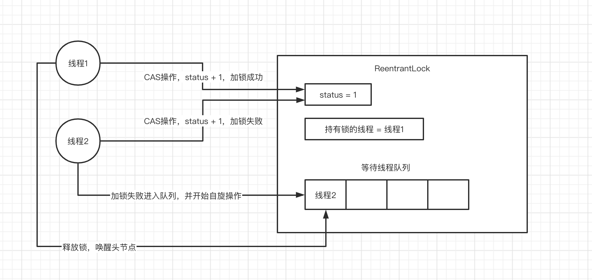
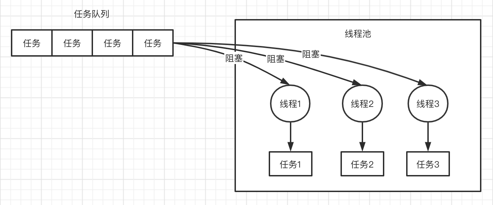
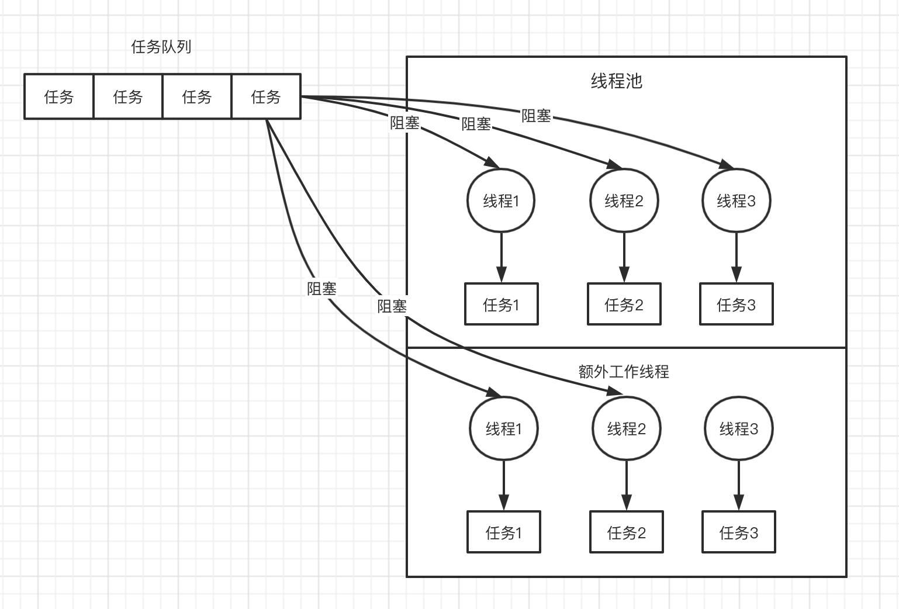
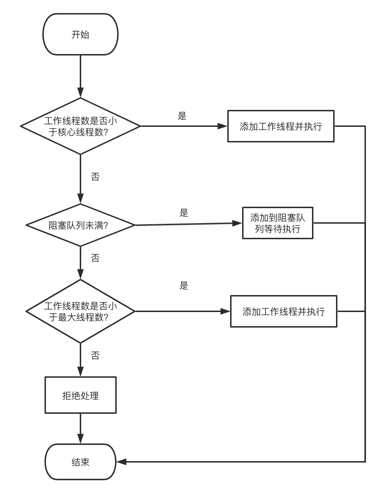

## 集合框架
 
### 你知道HashMap底层的数据结构是什么吗？
数组 + 链表 + 红黑树

### JDK1.8 中对hash算法和寻址算法是如何优化的？
HashMap中的hash算法：计算key的hashCode值，并把高16位和底16位进行异或运算。

HashMap中的寻址算法：hash & (n - 1) 代替 取模运算，因为位运算性能要高。

为什么hash算法中要对高位和低位进行异？

优化 hash 算法，减少 hash 冲突。因为后面的寻址算法中，会进行 hash & (n - 1) 运算，一般情况下 (n - 1) 比较小，所以 hash 值的高位会被直接丢弃掉，可以认为高位没有参与运算，高位的特征值被直接丢弃掉了。而 hash 算法中，把高位和低位进行异或运算，保留了高位的特征，后面进行寻址算法的时候，高位部分也能参与进来。

为什么寻址算法中 & 运算比取模运算性能高？

因为在HashMap的构造方法中 会把 n 约束为 >= n 的 2的幂，所以就能保证 & 运算的结果和取模的结果一致。

为什么 HashMap 中数组的大小为 2 的幂？

### 你知道HashMap是如何解决hash碰撞问题的吗？

hash 碰撞：两个不同的key，经过hashCode运算出 hash 值，进行寻址算法定位出来的数组下标一样

链表 O(n)

链表长度超过一定数量时会转换为红黑树 O(logn)

### 说说HashMap的 put 方法？

1. 扩容 当数组为空时，需要扩容（初始化）
2. 查询 根据 key 的 hash 值 + 寻址算法定位到 数组对应索引 
3. 插入 
	* 数组槽位为空，直接插入
	* 数组槽位非空，根据 key 的引用和 key.equals() 方法进行匹配，匹配不到就插入，匹配到再决定是否替换
4. 扩容 插入之后，判断 hash 的实际容量是否大于阈值，决定是否需要扩容

### 说说HashMap是如何进行扩容的？

扩容步骤：

1. 数组容量翻倍
2. 遍历 hash 表中数组，对每个Node进行 rehash （重新计算其在新数组中的下标 ）

JDK1.8 rehash 的技巧：扩容之后，需要重新计算 hash 值在新数组中的下标，而寻址算法 hash & (newCap - 1) 有个特点，(newCap - 1) 的二进制值比 (oldCap - 1) 多一个 "1"，因此 rehash 计算出新数组中的下标只有两种可能：

* 保持不变
* 原位置 + oldCap

## 并发编程
 
### 说说synchronized关键字的底层原理是什么？

#### 较浅的理解
synchronized 主要用于加锁，一般是给一个对象加锁。线程1执行代码给 obj1 加锁，那么线程2执行代码，就需要等待现在其他现场释放 obj1 对象上的锁。 

注意：锁住的是对象

```
Object obj1 = new Object();
Object obj2 = new Object();

synchronized (obj1) {
    // 各种操作
}

synchronized (obj2) {
    // 各种操作
}
```

#### 深入理解
理解 synchronized 之前还需要介绍一些额外的知识：Java 对象头、monitor

**Java 对象头**

以Hotspot虚拟机为例，Hotspot的对象头主要包括两部分数据：Mark Word（标记字段）、Klass Pointer（类型指针）。Mark Word 中储存锁状态，锁状态包括无锁、偏向锁、轻量级锁、重量级锁

对象头锁状态是如何升级的？

**Monitor**

Monitor可以理解为一个同步工具或一种同步机制，通常被描述为一个对象。每一个Java对象就有一把看不见的锁，称为内部锁或者Monitor锁。

对象头和 Monitor 都能找到持有锁的线程id。在对象头中对于不同锁状态的对象头其储存的锁信息不一样。

Monitor是线程私有的数据结构，每一个线程都有一个可用monitor record列表，同时还有一个全局的可用列表。每一个被锁住的对象都会和一个monitor关联，同时monitor中有一个Owner字段存放拥有该锁的线程的唯一标识，表示该锁被这个线程占用。

**继续研究 synchronized**

Monitor中有储存持有锁的线程id，和计数器。线程A抢到锁，计数器会加 1。线程B会判断计数器是否为 0，如果不为 0 则挂起。

**synchronized 重入原理**

判断 Monitor中当线程id是否为当前线程id，是，则计数器加 1。每执行完一次同步，Monitor 中的计数器减 1。

### 能聊聊你对CAS的理解以及其底层实现原理可以吗？

CAS全称为 compareAndSwap。

场景：线程A、线程B、共享变量 a = 1，以AtomicInteger的自增函数为例子

1. 线程 A 准备给共享变量自增，首先线程 A 会读出变量 a 的值
2. 线程 A 带着之前读出的旧值，以及准备设置的新值
3. CAS操作（CAS操作在硬件级别是原子的），判断旧值是否等一当前内存中a的值，等于那么设置成功，不等于设置失败。
4. 重复步骤1 ～ 3


### ConcurrentHashMap实现线程安全的底层原理到底是什么？
JDK 1.7 中 ConcurrentHashMap 数据结构

JDK1.8 put()方法原理

首先是自旋（死循环）操作，数组节点为null采用CAS操作，数组节点为非空则对数组对非空节点加锁，再进行相应的插入操作。

### 你对JDK中的AQS理解吗？讲讲ReentrantLock实现原理？

AQS 全称 AbstractQueuedSynchronizer，里面主要包括 status 状态，以及获取锁和释放锁的模版方法

ReentrantLock实现原理


1. 线程1加锁，检查status == 0 ? 是，则加锁成功，status + 1，设值持有锁的线程 = 线程1
2. 线程2加锁，检查status == 0 ？否，加锁失败，线程2进入等待队列，并开始自旋操作
3. 线程1执行完同步代码，释放锁，status - 1，持有锁的线程 = null，唤醒等待队列的头节点

注意 ReentrantLock 中公平锁和非公平锁的区别

### 说说线程池的底层工作原理可以吗？

以 newFixedThreadPool 为例子，说一说线程池的原理。

```
// 核心线程池数量为3
ExecutorService threadPool = Executors.newFixedThreadPool(3);

threadPool.submit(new Callable() {
    public void run() {}
});
```


<center></center>

提交任务流程

1. 检查当前工作线程数是否小于corePoolSize
2. 是，则创建新工作线程执行任务。否，则将任务放入队列
3. 执行完任务的线程会阻塞的去队列中取任务

<center></center>

### 那你再说说线程池的核心配置参数都是干什么的？平时我们应该怎么用？
```
public ThreadPoolExecutor(int corePoolSize,
                              int maximumPoolSize,
                              long keepAliveTime,
                              TimeUnit unit,
                              BlockingQueue<Runnable> workQueue,
                              RejectedExecutionHandler handler)
```

* corePoolSize 线程池核心线程数
* maximumPoolSize 线程池最大线程数
* keepAliveTime 额外线程（除核心外）空闲时，最大存活时间
* unit keepAliveTime 的单位
* workQueue 阻塞队列
* handler 任务拒绝策略

以如下构造为例，聊一聊线程池工作原理

```
new ThreadPoolExecutor(3, 6, 600L, TimeUnit.SECONDS, new ArrayBlockingQueue<Runnable>(1000));
```

<center></center>

<center></center>

### 如果线上机器突然宕机，线程池的阻塞队列中的请求怎么办？
常规解决办法

任务在提交之前先持久化，并维护状态，未提交、已提交、已完成。发生宕机重启之后，启动一个后台线程取扫描数据库，把未提交和已提交状态的任务读取出来放入队列。

### 谈谈你对Java内存模型的理解可以吗？
